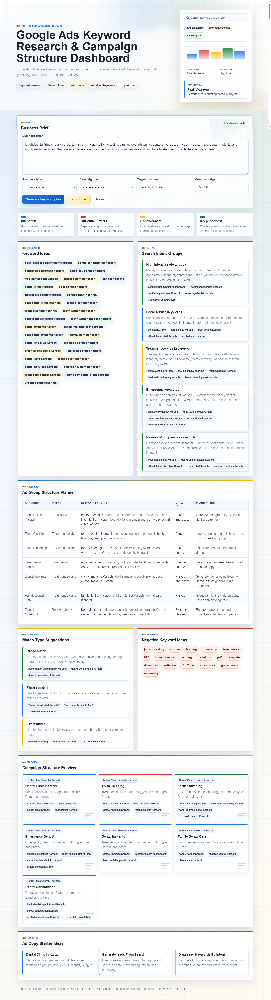

# Google Ads Keyword Research & Campaign Structure Dashboard

A professional frontend portfolio project that turns a short business brief into a practical Google Ads keyword research and campaign structure plan.

Live Demo: https://fazilprojects.github.io/google-ads-keyword-research-dashboard/

# Google Ads Keyword Research & Campaign Structure Dashboard

A professional frontend portfolio project that turns a short business brief into a practical Google Ads keyword research and campaign structure plan.

Live Demo: https://fazilprojects.github.io/google-ads-keyword-research-dashboard/

## Screenshot



## Project Purpose

This project was built by Fazil Waseem as a Google Ads and performance marketing portfolio project.

The goal is to show practical understanding of search campaign planning workflows, including keyword research, search intent grouping, ad group structure, match type planning, negative keywords, and campaign organization.

This is not a real Google Ads platform and does not connect to Google Ads, keyword volume APIs, or live campaign data. It is a local JavaScript-based planning dashboard.

## What It Does

The user enters a short business brief, selects a business type, campaign goal, target location, and budget. The dashboard then generates a structured keyword research and campaign planning outline.

The generated plan includes:

- Keyword ideas
- Search intent groups
- Ad group structure
- Match type suggestions
- Negative keyword ideas
- Campaign structure preview
- Ad copy starter ideas
- Exportable keyword plan

## Key Features

- Short brief to keyword plan workflow
- Google Ads search campaign planning structure
- 24+ keyword idea generation
- Search intent grouping
- Ad group planner
- Broad, phrase, and exact match type suggestions
- Negative keyword list
- Campaign structure preview
- Starter ad copy ideas
- Export plan feature
- Reset functionality
- Responsive mobile-friendly layout
- No external APIs
- No external frameworks

## Test Example

Example campaign used for testing:

**Business:** Bright Dental Studio  
**Business type:** Local service  
**Campaign goal:** Generate leads  
**Location:** Karachi, Pakistan  
**Budget:** 150000  

The dashboard generated keyword ideas, intent groups, dental-specific ad groups, match type suggestions, negative keywords, campaign structure cards, and starter ad copy ideas.

## Tech Stack

- HTML
- CSS
- JavaScript
- GitHub Pages

## Folder Structure

```text
.
├── index.html
├── style.css
├── script.js
├── README.md
├── AGENTS.md
└── docs/
    ├── PROJECT_BRIEF.md
    ├── DESIGN_SYSTEM.md
    └── CONTENT.md
